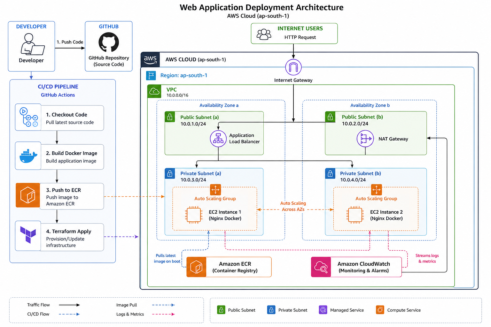
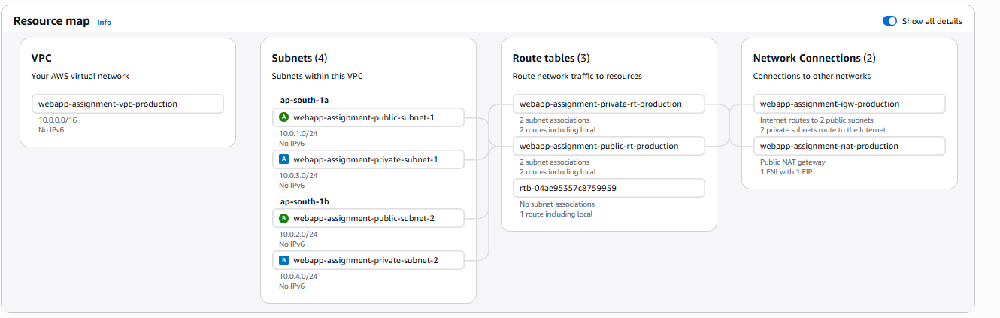
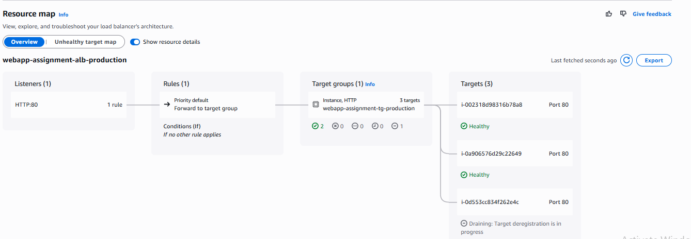
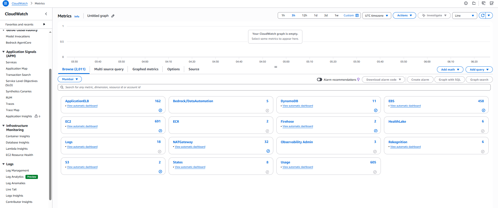

# AWS Production Infrastructure — Containerized Web Application

> **End-to-end automated infrastructure using Terraform, GitHub Actions CI/CD, Auto Scaling, ALB, CloudWatch monitoring, and S3 remote state with DynamoDB locking.**



**DNS Endpoint (ALB):**
```
http://webapp-assignment-alb-production-909502075.ap-south-1.elb.amazonaws.com/

Note: Domain Name will not configure Becoz i don't have to map the domain address and if domain maps through route 53 it should have ssl certificate with alb then it will secure connection

```

The application is live and publicly accessible via the ALB DNS name above. It serves a containerized Nginx web application displaying the architecture flow — deployed fully via GitHub Actions CI/CD and Terraform IaC. The page confirms:

- ✅ All Systems Operational
- ✅ Architecture flow: `Users → ALB → Auto Scaling Group → Docker (EC2 Private) → Nginx App`
- ✅ Deployed via GitHub Actions CI/CD · Terraform IaC · Containerized with Docker · Monitored by CloudWatch

> **Note:** The connection shows "Not Secure" because HTTPS/TLS is not yet configured. Adding ACM + Route53 is listed as a future improvement.

---

## Table of Contents

1. [Architecture Overview](#1-architecture-overview)
2. [VPC & Network Design](#2-vpc--network-design)
3. [Compute Layer — Auto Scaling Group](#3-compute-layer--auto-scaling-group)
4. [Load Balancer Configuration](#4-load-balancer-configuration)
5. [Terraform Remote Backend — S3 + DynamoDB](#5-terraform-remote-backend--s3--dynamodb)
6. [CI/CD Pipeline — GitHub Actions](#6-cicd-pipeline--github-actions)
7. [Monitoring & Alerting — CloudWatch](#7-monitoring--alerting--cloudwatch)
8. [Security Design](#8-security-design)
9. [Cost Optimization](#9-cost-optimization)
10. [Design Decisions & Trade-offs](#10-design-decisions--trade-offs)
11. [Future Improvements](#11-future-improvements)

---

## 1. Architecture Overview

### Region
`ap-south-1` (Mumbai)

### Traffic Flow

```
Internet Users
      │
      ▼
Internet Gateway (IGW)
      │
      ▼
Application Load Balancer  ←── Public Subnets (ap-south-1a, ap-south-1b)
      │
      ▼
Auto Scaling Group (EC2 t3.micro)  ←── Private Subnets (ap-south-1a, ap-south-1b)
      │  Docker containers (Nginx)
      ▼
NAT Gateway  ──▶  ECR (Docker Image Pull)
```

The ALB sits in public subnets and distributes traffic across EC2 instances running in private subnets. Instances pull Docker images from ECR via a NAT Gateway — they are never directly exposed to the internet.

---

## 2. VPC & Network Design



### VPC Configuration

| Resource | Value |
|---|---|
| VPC Name | `webapp-assignment-vpc-production` |
| CIDR Block | `10.0.0.0/16` |
| IPv6 | Disabled |

### Subnet Layout

| Subnet | AZ | CIDR | Type |
|---|---|---|---|
| `webapp-assignment-public-subnet-1` | ap-south-1a | `10.0.1.0/24` | Public (ALB) |
| `webapp-assignment-private-subnet-1` | ap-south-1a | `10.0.3.0/24` | Private (App) |
| `webapp-assignment-public-subnet-2` | ap-south-1b | `10.0.2.0/24` | Public (ALB) |
| `webapp-assignment-private-subnet-2` | ap-south-1b | `10.0.4.0/24` | Private (App) |

### Route Tables

| Route Table | Associations | Purpose |
|---|---|---|
| `webapp-assignment-public-rt-production` | 2 public subnets | Routes internet traffic via IGW |
| `webapp-assignment-private-rt-production` | 2 private subnets | Routes outbound traffic via NAT Gateway |

### Network Connections

- **Internet Gateway** (`webapp-assignment-igw-production`): Routes internet traffic to the 2 public subnets.
- **NAT Gateway** (`webapp-assignment-nat-production`): Public NAT Gateway with 1 Elastic IP, allowing private EC2 instances to pull Docker images from ECR without being publicly reachable.

> **Design Rationale:** A single NAT Gateway (rather than one per AZ) was used intentionally to reduce cost by ~$32/month. The trade-off is that if the NAT Gateway AZ goes down, private instances in the other AZ temporarily lose outbound internet access — acceptable for this project scale.

---

## 3. Compute Layer — Auto Scaling Group

### ASG Details

| Property | Value |
|---|---|
| ASG Name | `webapp-assignment-asg-production` |
| Desired Capacity | `2` |
| Scaling Limits | Min: `1` / Max: `3` |
| Instance Type | `t3.micro` |
| AMI ID | `ami-085c5e1d88d722545` |
| Availability Zones | ap-south-1a, ap-south-1b |
| Distribution | Balanced best effort |

### Launch Template

| Property | Value |
|---|---|
| Template Name | `webapp-assignment-lt-production` |
| Version | Latest |
| Security Group | `sg-0bdbd3871589f7e35` |
| Key Pair | None (access via SSM) |
| Spot Instances | Disabled |

### Instance Startup (`user_data`)

When an instance boots, it automatically:
1. Authenticates to ECR using the instance's IAM role
2. Pulls the latest Nginx Docker image
3. Starts the container on port 80

This means **zero manual intervention** is needed when the ASG launches new instances during a scale-out event.

---

## 4. Load Balancer Configuration



### ALB Details

| Property | Value |
|---|---|
| Name | `webapp-assignment-alb-production` |
| Type | Application Load Balancer |
| Scheme | Internet-facing |
| IP Address Type | IPv4 |
| Status | Active |
| Availability Zones | ap-south-1a, ap-south-1b |
| DNS Name | `webapp-assignment-alb-production-909502075.ap-south-1.elb.amazonaws.com` |

### Listener Configuration

| Protocol | Port | Action |
|---|---|---|
| HTTP | 80 | Forward to `webapp-assignment-tg-production` (100%) |

> **Future:** HTTPS (port 443) with ACM certificate should be added for production-grade TLS termination.

### Target Group Health

| Target | Instance ID | Port | Status |
|---|---|---|---|
| Instance 1 | `i-0a906576d29c22649` | 80 | ✅ Healthy |
| Instance 2 | `i-0d553cc834f262e4c` | 80 | ✅ Healthy |

Both instances pass health checks. Traffic is distributed evenly via round-robin. Target group stickiness is **off** to ensure stateless, balanced load distribution.

---

## 5. Terraform Remote Backend — S3 + DynamoDB

To safely manage infrastructure state across team members and CI/CD pipelines, Terraform uses a **remote backend** instead of storing `terraform.tfstate` locally.

### Backend Configuration (`backend.tf`)

```hcl
terraform {
  backend "s3" {
    bucket         = "webapp-assignment-tfstate-production"
    key            = "production/terraform.tfstate"
    region         = "ap-south-1"
    encrypt        = true

    dynamodb_table = "webapp-assignment-tfstate-lock"
  }
}
```

### S3 Bucket — State Storage

| Property | Value |
|---|---|
| Bucket Name | `webapp-assignment-tfstate-production` |
| Versioning | **Enabled** — every state change creates a new version |
| Encryption | Server-side encryption (SSE-S3) |
| Public Access | Blocked |

**Why versioning?** If a `terraform apply` corrupts the state file (e.g., partial failure), versioning lets you restore the previous known-good state file without data loss.

### DynamoDB Table — State Locking

| Property | Value |
|---|---|
| Table Name | `webapp-assignment-tfstate-lock` |
| Partition Key | `LockID` (String) |
| Billing | Pay-per-request |

**Why DynamoDB locking?** Without a lock, two simultaneous `terraform apply` runs (e.g., a developer and the CI/CD pipeline) could corrupt the state file by writing conflicting changes. DynamoDB provides atomic locking — only one process can hold the lock at a time. The lock is automatically released when the operation completes or times out.

### State Management Workflow

```
Developer / GitHub Actions
         │
         ▼
terraform init  →  Downloads backend config from S3
         │
         ▼
terraform plan  →  Reads current state from S3, acquires DynamoDB lock
         │
         ▼
terraform apply →  Writes new state to S3 (versioned), releases lock
```

---

## 6. CI/CD Pipeline — GitHub Actions

The project uses **4 GitHub Actions workflows** to fully automate the infrastructure and application lifecycle.

### Workflow 1 — `build.yaml` (On Push to Main)

Triggers on every code push to the `main` branch.

```
Push to main
     │
     ▼
Checkout code
     │
     ▼
Build Docker Image (Nginx)
     │
     ▼
Authenticate to AWS ECR (via OIDC / IAM Role)
     │
     ▼
Push image to ECR
     │
     ▼
Tag image with Git SHA + latest
```

### Workflow 2 — `infra.yaml` (Infrastructure Provisioning)

Automates the full Terraform lifecycle.

```
Triggered manually or on infra changes
            │
            ▼
terraform init  (S3 backend + DynamoDB lock)
            │
            ▼
terraform plan  (shows diff, saves plan file)
            │
            ▼
terraform apply (provisions VPC, ALB, ASG, SGs, IAM roles)
            │
            ▼
Post-deploy validation (curl ALB DNS endpoint, expect HTTP 200)
```

### Workflow 3 — `drift.yaml` (Drift Detection)

Runs on a schedule (e.g., daily cron) to detect infrastructure drift — changes made manually in the AWS Console that are not reflected in Terraform code.

```
Scheduled trigger (cron)
         │
         ▼
terraform plan --detailed-exitcode
         │
         ├── Exit 0: No changes → infra matches code ✅
         │
         └── Exit 2: Drift detected → Slack/email alert + PR raised
```

### Workflow 4 — `destroy.yaml` (Teardown)

Manual workflow to safely destroy all provisioned resources.

```
Manual trigger (workflow_dispatch)
         │
         ▼
Requires confirmation input ("yes")
         │
         ▼
terraform destroy --auto-approve
         │
         ▼
All resources removed from AWS
```

### Deployment Flow Summary

```
Developer pushes code
         │
         ▼
build.yaml: Docker image built and pushed to ECR
         │
         ▼
infra.yaml: Terraform applies any infra changes
         │
         ▼
ASG instances boot → user_data pulls latest image from ECR → Nginx starts
         │
         ▼
ALB health check passes → traffic routed to new instances ✅
```

---

## 7. Monitoring & Alerting — CloudWatch



Two CloudWatch alarms are configured to proactively detect performance anomalies.

### Alarm 1 — Low CPU Utilization (Scale-in Warning)

| Property | Value |
|---|---|
| Alarm Name | `webapp-assignment-low-cpu-production` |
| Metric | `CPUUtilization` |
| Condition | `< 20%` for 2 datapoints within 4 minutes |
| Purpose | Detects under-utilization; signals over-provisioning or idle instances |

### Alarm 2 — High Response Time (Latency Alert)

| Property | Value |
|---|---|
| Alarm Name | `webapp-assignment-high-response-time-prod` |
| Metric | `TargetResponseTime` |
| Condition | `> 1 second` for 2 datapoints within 2 minutes |
| Purpose | Detects ALB latency spikes indicating application or instance issues |

### Alarm States Observed

| Service | State | Notes |
|---|---|---|
| EC2 | 🔴 In Alarm (1) | Low CPU alarm triggered — instances running below 20% |
| Application ELB | ⊘ Insufficient Data (1) | Response time alarm — collecting baseline |
| ElasticLoadBalancing | ⊘ Insufficient Data (1) | Initializing |

> The low CPU alarm firing is **expected** for a newly provisioned environment with no real user traffic. It would trigger scale-in or send an SNS notification in a production scenario.

### What to Add Next

- SNS Topic → Email/Slack notification on alarm state change
- Auto Scaling policies tied to CPU alarms (scale-out > 70% CPU, scale-in < 20% CPU)
- CloudWatch Logs for Nginx access and error logs via the CloudWatch Agent

---

## 8. Security Design

### Security Group Rules

| Security Group | Inbound | Source | Purpose |
|---|---|---|---|
| ALB SG | TCP 80 | `0.0.0.0/0` | Public HTTP access |
| ALB SG | TCP 443 | `0.0.0.0/0` | (Future) HTTPS |
| App Instance SG | TCP 80 | ALB SG only | App only reachable from ALB |
| Jenkins SG | TCP 8080 | Your IP only | Jenkins UI access |
| Jenkins SG | TCP 22 | Your IP only | SSH access (if needed) |

**Key principle:** App EC2 instances have no direct internet access and accept traffic only from the ALB Security Group — not from the public internet.

### IAM Roles — Least Privilege

| Role | Permissions |
|---|---|
| App EC2 Instance Profile | `ecr:GetAuthorizationToken`, `ecr:BatchGetImage` (ECR pull only) |
| App EC2 Instance Profile | `logs:PutLogEvents`, `logs:CreateLogStream` (CloudWatch Logs) |
| GitHub Actions OIDC Role | Scoped to `terraform apply` on specific resources only |

No long-lived access keys are used. GitHub Actions authenticates to AWS via **OIDC** (OpenID Connect), which generates short-lived credentials per workflow run.

### Network Security

- EC2 instances in **private subnets** — no public IPs
- NAT Gateway for outbound-only internet access (ECR image pulls)
- No SSH key pair on app instances — access via AWS Systems Manager (SSM) if needed
- S3 state bucket has **public access blocked** and **server-side encryption** enabled

---

## 9. Cost Optimization

| Decision | Monthly Saving | Trade-off |
|---|---|---|
| `t3.micro` instances (free tier eligible) | ~$15–20/instance saved vs t3.small | Suitable for low-medium traffic only |
| Single NAT Gateway (not one per AZ) | ~$32/month | Slight HA reduction for outbound traffic |
| ASG min=1, desired=2 | Scale in during off-hours | Brief capacity reduction possible |
| ECR lifecycle policy (keep last 5 images) | ~$2–5/month | Old images auto-deleted |
| No EC2 key pair (SSM access) | $0 | SSM Session Manager is free for EC2 |
| DynamoDB pay-per-request for lock table | ~$0 (near-zero usage) | N/A |
| S3 versioning for state | Minimal (~$0.01/GB/month) | Essential for state recovery |

**Estimated Monthly Cost (this architecture):** ~$40–70/month (2x t3.micro + ALB + NAT Gateway + S3 + minor services)

---

## 10. Design Decisions & Trade-offs

### EC2 + Docker vs ECS/Fargate

**Chosen:** EC2 with Docker directly on instances via ASG.

**Why:** Demonstrates foundational AWS skills — VPC design, launch templates, ASG scaling policies, ALB target groups. ECS/Fargate abstracts away these concepts.

**Trade-off:** More operational responsibility (patching AMIs, managing Docker daemon) vs. the managed experience of ECS Fargate.

### Nginx vs Flask

**Chosen:** Nginx as the containerized application.

**Why:** Faster startup time, minimal RAM (~5 MB vs ~50 MB for Flask), no runtime dependency issues, and better suited for serving static content or acting as a reverse proxy.

### Single Jenkins / GitHub Actions

**Chosen:** GitHub Actions for CI/CD (no self-hosted Jenkins).

**Why:** Zero infrastructure maintenance, native GitHub integration, OIDC for AWS auth, and free for public repos.

### Remote State from Day 1

**Chosen:** S3 + DynamoDB backend enabled immediately.

**Why:** Even solo projects benefit from versioned state. The cost is near-zero and prevents "works on my machine" state corruption issues.

---

## 11. Future Improvements

| Priority | Improvement | Benefit |
|---|---|---|
| High | Add HTTPS with ACM + Route53 | End-to-end TLS, production-ready |
| High | SNS alerts on CloudWatch alarms | Real-time incident notification |
| Medium | Auto Scaling policies (CPU-based) | Automatic scale-out/in |
| Medium | Migrate to ECS Fargate | No EC2/Docker management |
| Medium | CloudWatch Logs agent | Centralized application logging |
| Low | Multi-region deployment | Disaster recovery |
| Low | WAF on ALB | Protection against common web attacks |
| Low | AWS Config + Security Hub | Continuous compliance monitoring |

---

## Project Structure

```
├── .github/
│   └── workflows/
│       ├── build.yaml          # Docker build + ECR push
│       ├── infra.yaml          # Terraform provision
│       ├── drift.yaml          # Drift detection (scheduled)
│       └── destroy.yaml        # Teardown (manual)
├── terraform/
│   ├── backend.tf              # S3 + DynamoDB remote state
│   ├── main.tf                 # VPC, subnets, IGW, NAT
│   ├── alb.tf                  # ALB, listeners, target groups
│   ├── asg.tf                  # ASG, launch template
│   ├── security_groups.tf      # SG rules
│   ├── iam.tf                  # EC2 instance profile, GitHub OIDC role
│   ├── cloudwatch.tf           # Alarms
│   ├── ecr.tf                  # ECR repo + lifecycle policy
│   └── variables.tf / outputs.tf
├── app/
│   └── Dockerfile              # Nginx container definition
└── README.md
```

---

*Infrastructure provisioned with Terraform · CI/CD via GitHub Actions · Region: ap-south-1 (Mumbai)*
